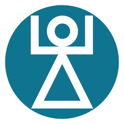

<p align="center">
  
</p>

<h1 align="center">Cartago</h1>

Ecommerce platform demo made from scratch with Next.js 14, NextAuth, TailwindCSS, Prisma (Postgres), AWS S3, Zod and Zustand.

## How it works

In theory, the same as any other ecommerce, although minified for obvious reasons and focused instead on ease of use. There are at least three roles from which most features emerge. Customers, who can "wish" products and add them to the shopping cart, from there they can checkout to create an order (by filling in some basic information), make a payment and confirm the subsequent delivery (sadly, we should clarify that nothing will be sent to you). Sellers, who can publish the different products and manage their inventory. Finally, Admins manage categories and have some additional privileges such as the ability to remove any product from the platform. All of this is what defines in practice the basic workflow of an ecommerce.

Compared to the big names in the sector, this one simplifies and/or lacks many typical features since the goal was not to create a fully-fledged platform but rather to get as close as possible to the concept through a collaborative learning project.

## Run it locally

1. Clone the repo `git clone git@github.com:DevCorvus/cartago.git`

2. Move into it `cd cartago` and install all dependencies with `npm run install`

3. Set the following environment variables in a `.env.local` file:

```bash
DATABASE_URL="your_postgres_database_url"
NEXTAUTH_SECRET="your_nextauth_secret"
AWS_BUCKET_REGION="your_aws_bucket_region"
AWS_BUCKET_NAME="your_aws_bucket_name"
AWS_S3_ACCESS_KEY="your_aws_s3_access_key"
AWS_S3_SECRET_ACCESS_KEY="your_aws_s3_secret_access_key"

# Optional
MODERATE_CONTENT_API_KEY="your_moderate_content_api_key"
```

4. Run migrations with `npm run migrate:push` and `npm run db:seed` to seed the database

5. Finally `npm run dev` and it should be working on `http://localhost:3000`

### What can be improved

- More granular and detailed categorization and properties/variants for product types
- Implement algorithm for recommendations and more search options
- Friendlier URLs
- Better security measures from bottom to top
- Make it work for real, not just as a demo

## Context

It started as a collaborative project with no clear direction beyond teamwork. A simple idea to make an Ecommerce was defined, establishing the initial design and the development methodology to follow. From this point on, the direction was clear and relatively constant progress was maintained, although it increasingly leaned more towards a didactic experience throughout the development.

Starting the late stage of development, the name, image and characteristic personality of the project was defined with many historical references such as the name whose origin is related to Carthage (Cartago in spanish), an ancient city-state recognized for its commercial and cultural relevance in the Mediterranean.

